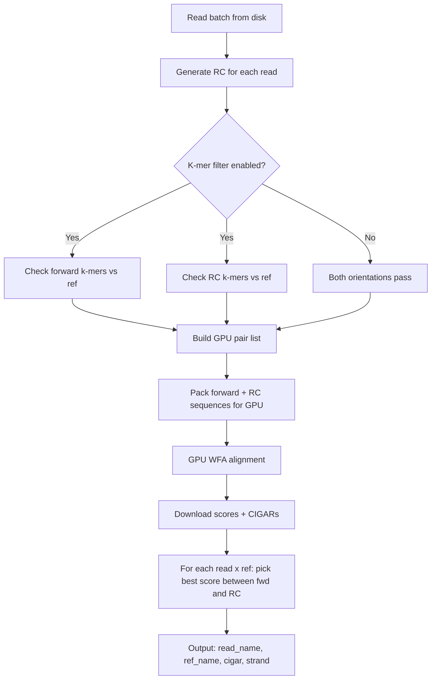

# Reverse Complement Alignment Plan

## Overview

Modify blep to always align each read in **both orientations** (forward and reverse complement) against every reference, then report only the best-scoring alignment with a strand indicator column (`+` or `-`).

## Design Decisions

- **Always-on**: No CLI flag needed; every read is aligned in both orientations
- **K-mer filter applies to both orientations independently**: If enabled, the forward and RC sequences are each checked against the reference k-mer set. Only orientations that pass the filter proceed to GPU alignment
- **Best-score wins**: For each read×ref pair, the orientation with the lower alignment score is reported. If only one orientation was aligned (the other was filtered), that one is reported. If neither passes the k-mer filter, the pair is reported as `FAILED`
- **Output change**: A new `strand` column is added to the TSV output (`+` for forward, `-` for reverse complement)

## Architecture



## Implementation Details

### 1. Add `reverse_complement()` utility function

```rust
fn reverse_complement(seq: &[u8]) -> Vec<u8> {
    seq.iter().rev().map(|&b| match b {
        b'A' | b'a' => b'T',
        b'T' | b't' => b'A',
        b'C' | b'c' => b'G',
        b'G' | b'g' => b'C',
        b'N' | b'n' => b'N',
        _ => b'N',
    }).collect()
}
```

### 2. Modify `PreparedBatch` struct

Add fields to track RC sequences and strand information:

```rust
struct PreparedBatch {
    // ... existing fields ...
    
    // RC sequence data (packed for GPU upload)
    rc_query_data: Vec<i8>,
    rc_query_lengths: Vec<usize>,
    rc_query_offsets: Vec<usize>,
    
    // Strand tracking for GPU pairs
    // Each GPU pair now has an associated strand: true = forward, false = RC
    pair_strand: Vec<bool>,  // true = forward (+), false = RC (-)
    
    // Mapping: for each (read_idx, ref_idx) pair, track which GPU indices
    // correspond to forward and RC alignments
    fwd_gpu_idx: Vec<Option<usize>>,  // indexed by global pair idx
    rc_gpu_idx: Vec<Option<usize>>,   // indexed by global pair idx
}
```

### 3. Modify CPU background thread

The CPU thread currently:
1. Reads a batch of sequences
2. Runs k-mer filter for each read×ref pair
3. Builds pair indices for passing pairs

New logic:
1. Reads a batch of sequences
2. **Generates reverse complement for each read**
3. Runs k-mer filter for **forward** read×ref pairs
4. Runs k-mer filter for **RC** read×ref pairs
5. Builds pair indices including both orientations that pass
6. Packs **both** forward and RC query sequences for GPU upload

**Key insight for GPU packing**: We pack all forward sequences first, then all RC sequences into a single combined buffer. The pair indices reference into this combined buffer using a virtual query index scheme:
- Query indices `0..num_reads` → forward sequences
- Query indices `num_reads..2*num_reads` → RC sequences

### 4. Modify GPU alignment section

The GPU kernel itself doesn't change — it just aligns whatever pairs it's given. The change is in how we set up the pairs:

- Upload the combined query buffer (forward + RC sequences concatenated)
- Upload combined lengths and offsets arrays
- The pair indices now reference into the combined buffer
- Each GPU pair is tagged with its strand for later lookup

### 5. Best-score selection logic

After downloading GPU results:

```rust
for qi in 0..num_reads {
    for ri in 0..num_refs {
        let global_idx = qi * num_refs + ri;
        
        let fwd_result = fwd_gpu_idx[global_idx].map(|idx| (all_scores[idx], &all_cigar_ops[idx]));
        let rc_result = rc_gpu_idx[global_idx].map(|idx| (all_scores[idx], &all_cigar_ops[idx]));
        
        match (fwd_result, rc_result) {
            (None, None) => write "FAILED",
            (Some((score, cigar)), None) => write cigar with strand "+",
            (None, Some((score, cigar))) => write cigar with strand "-",
            (Some((fwd_s, fwd_c)), Some((rc_s, rc_c))) => {
                // Lower score = better alignment in WFA
                if fwd_s <= rc_s { write fwd_c with "+" }
                else { write rc_c with "-" }
            }
        }
    }
}
```

**Edge cases**:
- If one orientation hits CPU fallback (score = -1 from GPU), run CPU fallback for that orientation
- If both orientations need CPU fallback, run both and pick the best
- If an orientation's CPU fallback also fails (returns `*`), treat it as infinitely bad

### 6. Output format change

Before:
```
read_name    reference_name    cigar    [tag_values...]
```

After:
```
read_name    reference_name    cigar    strand    [tag_values...]
```

The `strand` column contains `+` (forward) or `-` (reverse complement).

### 7. GPU memory impact

This approximately doubles the number of GPU pairs (in the worst case where both orientations pass the k-mer filter for every pair). The existing sub-batching logic already handles memory pressure by splitting work into chunks that fit in VRAM, so this should work transparently — it will just use more sub-batches if needed.

When the k-mer filter is enabled, the actual increase will be less than 2x because many orientation×ref combinations will be filtered out.

## Files to modify

| File | Changes |
|------|---------|
| `src/main.rs` | Add `reverse_complement()`, modify `PreparedBatch`, modify CPU thread, modify GPU result handling, modify output |
| `README.md` | Document strand-aware alignment, update output format docs |

## No changes needed

| File | Reason |
|------|--------|
| `cuda/wfa_kernel.cu` | Kernel is orientation-agnostic; it aligns whatever pairs it receives |
| `build.rs` | No kernel changes |
| `Cargo.toml` | No new dependencies needed |
